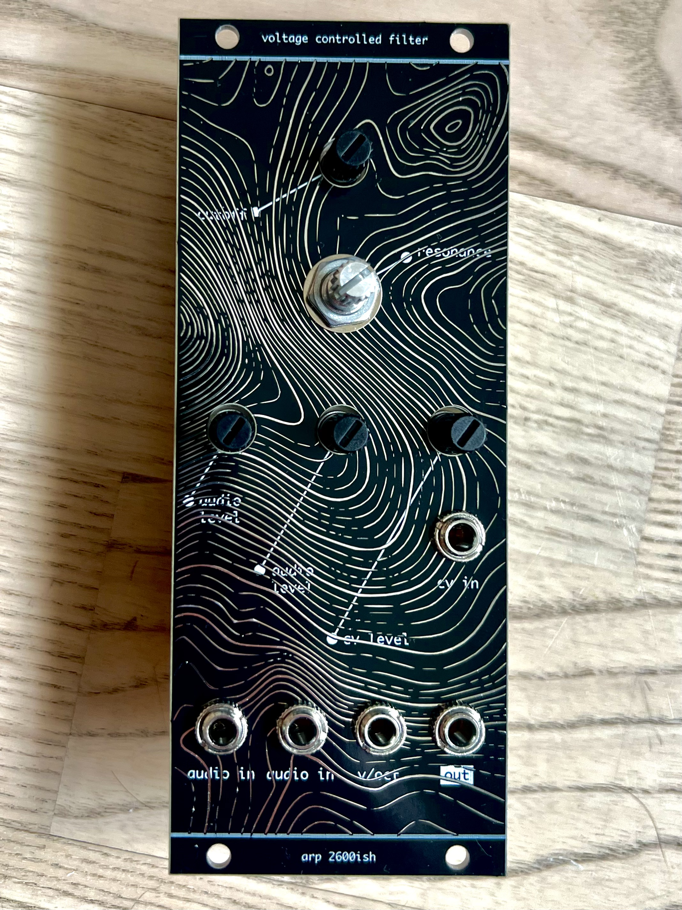
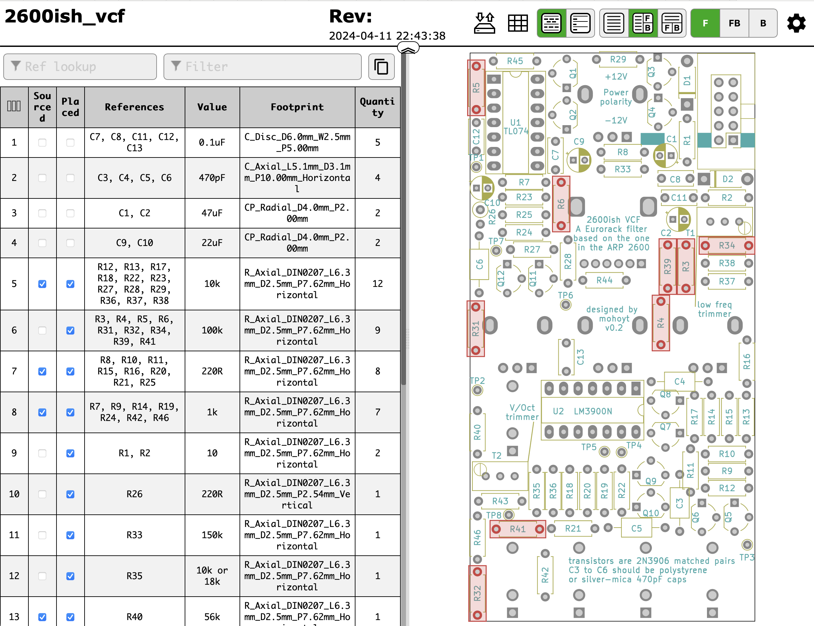
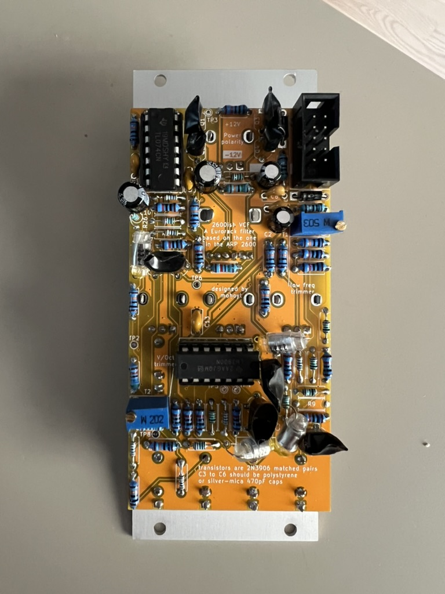

# 2600ish_vcf

This is a fully through hole component Eurorack voltage controlled low pass filter based on the one in the ARP 2600. There were different filters in the ARP 2600 at different times, this is the 4072 variety and is not a diode ladder filter like the early one. 

Inspiration and the starting point for schematics for this filter taken from [Eddy Bergman](https://www.eddybergman.com/2020/03/synthesizer-build-part-21-arp2600.html) and [Yusynth](http://yusynth.net/Modular/EN/ARPVCF/index.html)

This module is 10hp (~50mm) wide and runs on a standard dual rail 12v eurorack supply.

See a longer write up of this project on my website: [https://mohoyt.com/blog/2024/2600ish-vcf](https://mohoyt.com/blog/2024/2600ish-vcf)

Special thanks to [PCBWay](https://pcbway.com) for sponsoring this build.

## Gerbers

See the most recent gerbers on the releases tab. The gerbers included are configured for PCBWay. There are two sets, one for the panel and one for the PCB. 

## Bill of Materials

See the iBOM in the [BOM](bom) folder. You will need matched 2N3906 transistors and ideally polystyrene caps for the four filter poles.

## Calibration and tuning 

Taken from [Yusynth](http://yusynth.net/Modular/index_en.html)

### V/Octave tracking:
- Turn the frequency knob to 0, turn all the control knobs to 0 (fully counter clockwise)
- Apply 0V to the V/Oct input
- Measure the voltage at the basis of Q3 (node between R46, R30 to R34), adjust T1 (low freq trimmer) in order to obtain 0V at this very node.
- Apply 1V to the V/Oct input
- Adjust T2 (v/octave trimmer) in order to measure 18.7mV at the previous node.
- Apply 0V to the V/Oct input
- Adjust T1 (low freq trimmer) in order to measure -187mV at this very node.
- After the Frequency range stting (see below) you may set the filter to oscilltion mode and slightly adjust T2 in order to achieve a good V/Octave tracking.

### Frequency range setting :
- Apply a 40Hz squarewave to one of the audio input, connect the output to an amplifier.
- Set the FREQUENCY potentiometer to 0 (fully counter clockwise)
- Adjust T1 (low freq trimmer) until no signal can be heard at the output, that's it!

## Notes and known issues
- v0.1 had an issue with an extra connection around R9, but fixable on the board by rerouting R9, cutting traces and adding a bodge wire. This is fixed in v0.2
- For the panel ensure that the silkscreen is *not* subtracted from the soldermask otherwise parts of the lines and words will be difficult to read
